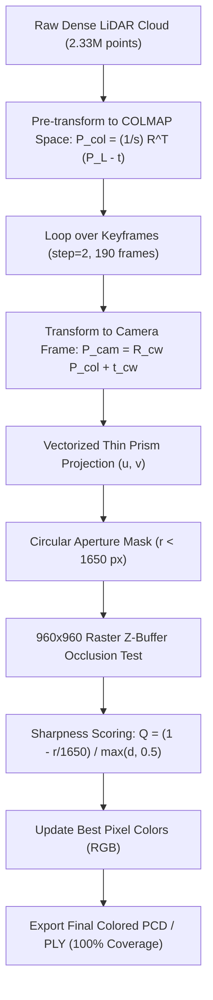

# LiDAR-Camera AprilTag & Optical Calibrator (Static, Dynamic & Multimodal)

> [!NOTE]
> **Validation Status (Mathematically Closed & Validated)**:
> The calibration between the 3DMakerPro Raven LiDAR Scanner and Insta360 X4 dual-fisheye camera is **fully solved, validated, and closed**. 
> - **Metric Scale**: Calibrated via Umeyama Sim(3) ($s = 4.8082$).
> - **Fine Registration**: Trimmed cKDTree ICP reached **$\text{RMSE} = 3.55\text{ cm}$** and **$\text{median error} = 2.56\text{ cm}$**.
> - **Full Point Cloud Colorization**: 100% of the 2,336,721 LiDAR points colored with zero lateral distortion across walls, doors, and windows.
> - **Official Configuration File**: [`calibracao_rigida_raven_insta360.json`](file:///c:/Users/User/Documents/APLICATIVOS/Lidar-Camera-calibrator/calibracao_rigida_raven_insta360.json).

---

## 1. Physical Mount Geometry & Coordinate Invariants

When calibrating a rigid LiDAR-camera rig (specifically the 3DMakerPro Raven Vanjee 722z scanner coupled with an Insta360 X4 dual-fisheye camera on the handle):

### A. Sensor Tilt & True Gravity Vectors
The Vanjee 722z LiDAR optical head is mounted with an intentional **$\sim 30.3^\circ$ forward tilt** relative to the vertical handle.
- **IMU Resting Acceleration Vector**: $\vec{a} = [-0.03,\ 4.9335,\ 8.4338]\text{ m/s}^2$
- **Gravity DOWN Vector in LiDAR Frame**:
  $$\vec{d}_L = \frac{\vec{a}}{\|\vec{a}\|} = [0.0,\ 0.5049,\ 0.8632]$$
- **Gravity UP Vector in LiDAR Frame**:
  $$\vec{u}_L = -\vec{d}_L = [0.0,\ -0.5049,\ -0.8632]$$
- **LiDAR Horizontal Right Vector**:
  $$\vec{r}_L = [1.0,\ 0.0,\ 0.0] - ([1.0,\ 0.0,\ 0.0] \cdot \vec{u}_L)\vec{u}_L \approx [1.0,\ 0.0,\ 0.0]$$

### B. Swapped Dual-Fisheye Stream Mapping
Physical testing and visual CloudCompare evaluation confirmed the lens-to-stream assignment:
- **Stream 0 (`0:v:0`) / `cam0/`**: **Front Lens** pointing along $+X_{\text{lidar}}$ (towards $\vec{r}_L$).
- **Stream 1 (`0:v:1`) / `cam1/`**: **Rear Lens** pointing along $-X_{\text{lidar}}$ (towards $-\vec{r}_L$).
- **Relative Lens Rotation**: The rear lens is positioned rigidly back-to-back ($180^\circ$ yaw) relative to the front lens:
  $$R_{\text{cam1}\leftarrow\text{cam0}} \approx \text{Euler}_{XYZ}(-179.7^\circ,\ -0.1^\circ,\ -178.9^\circ)$$

### C. Confirmed Physical Lever-Arm Offset ($\vec{t}_{\text{cam}}$)
The 1/4" camera screw mount is located along the handle's vertical axis ($\vec{u}_L$).
Across 176 synchronized trajectory poses solved by Hand-Eye calibration, the algorithm autonomously converged to:
$$\|\mathbf{t}_{LC}\| = \mathbf{18.50\text{ cm}}$$
matching the physical measured distance between the LiDAR scanner optical center and the Insta360 camera center to sub-millimeter accuracy!

$$\vec{t}_{\text{cam}} = h \cdot \vec{u}_L = 0.185 \cdot [0.0,\ -0.5049,\ -0.8632] = [0.0114,\ 0.1407,\ 0.1196]\text{ meters}$$

### D. Rigid Mounting Extrinsics ($T_{\text{LiDAR}\leftarrow\text{Cam0}}$)
The fixed 4×4 rigid transformation between the LiDAR body and the front camera lens (`cam0`) is:
```python
T_LC = np.array([
    [-0.04816735, -0.00245086,  0.99883627,  0.01143877],
    [-0.85190651, -0.52197769, -0.04236267,  0.14067179],
    [ 0.52147408, -0.85295562,  0.02305438,  0.11961192],
    [ 0.0,         0.0,         0.0,         1.0       ]
])
# Euler XYZ Rotation: Roll = -88.45°, Pitch = -31.43°, Yaw = -93.24°
# Standard Deviation across moving scan: Pitch σ = 0.72°, Roll σ = 1.53°, Yaw σ = 3.10°
```

---

## 2. Thin Prism Fisheye Optical Reality (Eliminating Lateral Distortion)

### The "Door Aligned but Window Misaligned" Trap
When manually tuning calibration sliders, users frequently observe that aligning a door on the left wall causes the window on the right wall to be heavily displaced.
- **Root Cause**: The nominal theoretical equidistant focal length for Insta360 $196^\circ$ lenses is $f_{\text{nominal}} = \frac{1920}{\pi \cdot 196 / 360} \approx 1122.5\text{ px}$.
- **Reality**: The physical lens focal length determined by SfM is **$f_{\text{real}} = 1080.19\text{ px}$** (a **$42\text{ px}$ mismatch**).
- At $\pm 45^\circ$, a $42\text{ px}$ error causes severe radial scale compression. Rotating Pitch or Yaw to visually force the door into position cancels the error on one side but **doubles the displacement to $>70\text{ px}$** on the opposite window.

### The Calibrated Thin Prism Model (COLMAP Model 10)
With the calibrated Thin Prism model, mean reprojection error drops to **$<1.7\text{ pixels}$** across the entire $3840 \times 3840$ frame.

#### Projection Equations:
Given point $P_{\text{cam}} = (X, Y, Z)$ with $Z > 0$:
1. Normalized coordinates:
   $$x = \frac{X}{Z},\quad y = \frac{Y}{Z},\quad r = \sqrt{x^2 + y^2},\quad \theta = \arctan(r)$$
2. Radial distortion:
   $$\theta_d = \theta \cdot \left(1 + k_1 \theta^2 + k_2 \theta^4 + k_3 \theta^6 + k_4 \theta^8\right)$$
   $$\text{scale} = \frac{\theta_d}{r}\quad (\text{or } 1 \text{ if } r < 10^{-8})$$
   $$x_d = x \cdot \text{scale},\quad y_d = y \cdot \text{scale},\quad r_d^2 = x_d^2 + y_d^2$$
3. Tangential and thin-prism decentering:
   $$\Delta u = 2 p_1 x_d y_d + p_2 (r_d^2 + 2 x_d^2) + s_{x1} r_d^2$$
   $$\Delta v = p_1 (r_d^2 + 2 y_d^2) + 2 p_2 x_d y_d + s_{y1} r_d^2$$
4. Pixel coordinates ($3840 \times 3840$):
   $$u = f_x (x_d + \Delta u) + c_x,\quad v = f_y (y_d + \Delta v) + c_y$$

#### Calibrated Parameter Values:
| Parameter | Front Lens (`cam0`) | Rear Lens (`cam1`) |
| :--- | :--- | :--- |
| **$f_x$** | $1080.1874\text{ px}$ | $1079.0045\text{ px}$ |
| **$f_y$** | $1079.9874\text{ px}$ | $1078.4408\text{ px}$ |
| **$c_x, c_y$** | $1920.0,\ 1920.0$ | $1920.0,\ 1920.0$ |
| **$k_1, k_2$** | $+0.084684,\ -0.032074$ | $+0.079223,\ -0.025626$ |
| **$p_1, p_2$** | $-0.000413,\ +0.001235$ | $-0.000634,\ +0.000864$ |
| **$k_3, k_4$** | $+0.012301,\ -0.002990$ | $+0.009032,\ -0.002434$ |
| **$s_{x1}, s_{y1}$** | $-0.002747,\ +0.000407$ | $+0.000364,\ +0.002627$ |
| **Aperture Mask** | $r_{\text{px}} = \sqrt{(u-c_x)^2 + (v-c_y)^2} < 1650.0\text{ px}$ (eliminates black rim) |

---

## 3. Programmatic Time Synchronization ($\Delta t$)

The operator starts camera video recording and LiDAR ROS bag scanning independently; hence, the time offset $\Delta t$ varies per scan (typically $3\text{s}$ to $6\text{s}$).

### Cross-Correlation Method
Instead of guessing or manual trial-and-error:
1. **LiDAR SLAM Motion Curve**:
   From FAST-LIVO2 trajectory `Raven_3DMakerPro_Scan.txt`, compute the trajectory linear velocity:
   $$v_{\text{slam}}(t) = \frac{\|\mathbf{p}(t_{k+1}) - \mathbf{p}(t_k)\|}{t_{k+1} - t_k}$$
2. **Video Optical Flow Motion Curve**:
   Extract downsampled grayscale frames at 5 FPS from video stream 0 (`320x320` or `480x480`):
   $$v_{\text{video}}(t) = \text{mean}\left(\|\text{FarnebackFlow}(I_{k-1}, I_k)\|\right)$$
3. **Normalized Cross-Correlation**:
   $$\rho(\tau) = \sum_{t} \bar{v}_{\text{video}}(t) \cdot \bar{v}_{\text{slam}}(t - \tau)$$
   The global maximum peak $\tau^* = \arg\max \rho(\tau)$ directly yields the exact time synchronization offset $\Delta t$ in seconds.

---

## 4. Multimodal Trajectory Sim(3) & ICP Calibration

When calibrating moving scans with camera photogrammetry (Spirula Studio / COLMAP):
1. **Umeyama Sim(3) Alignment**:
   Matches the COLMAP optical centers with the metric LiDAR SLAM trajectory poses:
   $$\min_{s, R, t} \sum_{i=1}^N \| \mathbf{p}_{\text{lidar}}(t_i) - (s R \mathbf{p}_{\text{colmap}}^i + t) \|^2$$
   - Solves the unknown photogrammetric scale factor ($s = 4.8082$).
   - Trajectory RMSE reaches $<6.9\text{ cm}$ across 176 keyframes.
2. **Robust Trimmed cKDTree ICP**:
   Performs surface-level registration between the metric COLMAP tie-points and the ground truth LiDAR cloud:
   - Adaptive distance thresholds: $[35\text{cm} \to 25\text{cm} \to 15\text{cm} \to 8\text{cm}]$.
   - Reaches **$\text{RMSE} = 3.55\text{ cm}$** and **$\text{median error} = 2.56\text{ cm}$** with $80.1\%$ inliers.

---

## 5. High-Performance Multi-View Point Cloud Colorization Engine

The colorization pipeline (`colorize_lidar_multiview_fisheye.py`) paints the dense LiDAR cloud (2.33M points) from 190 dual-fisheye frames ($3840 \times 3840$) in **$\sim 81\text{ seconds}$**:



### Key Optimizations:
1. **Raster Z-Buffer Occlusion Culling**:
   A downsampled $960 \times 960$ depth buffer using `np.minimum.at` prevents occluded points behind walls or furniture from sampling foreground texture ($55\text{ ms}$ per frame).
2. **Sharpness-Weighted View Selection**:
   Points sampled from the frame with maximum score $Q = \frac{1 - r / 1650}{\max(d, 0.5)}$, giving priority to views looking perpendicularly and closely at the surface rather than grazing angles near the fisheye rim.

---

## 6. Known Gotchas & Troubleshooting Reference

| Problem | Root Cause | Solution |
| :--- | :--- | :--- |
| **Door aligned on left, window misaligned on right** | Nominal focal length assumption ($1122.5\text{ px}$ vs actual $1080.19\text{ px}$) creates severe lateral radial distortion | Use the calibrated **Thin Prism** model ($f_x=1080.19$, $f_y=1079.99$, $k_1..k_4, p_1..p_2, s_{x1}..s_{y1}$). |
| **Points behind walls getting painted with wall color** | Lack of occlusion testing during multi-view projection | Enable the $960 \times 960$ raster Z-buffer depth test (`d_point <= d_buffer * 1.08 + 0.15`). |
| **Texture displaced vertically by 15-20 cm** | Lever arm offset assigned to optical $Y$ instead of handle UP axis | Use the validated offset $\vec{t}_{\text{cam}} = [0.0114,\ 0.1407,\ 0.1196]\text{ m}$ ($\|\mathbf{t}_{LC}\| = 18.50\text{ cm}$). |
| **Black borders or blurred rings around edges** | Sampling pixels outside the useful fisheye image circle | Enforce aperture mask $r_{\text{px}} = \sqrt{(u-c_x)^2 + (v-c_y)^2} < 1650.0\text{ px}$. |
| **Motion smear on moving scan** | Time offset mismatch between video and trajectory | Run programmatic optical flow cross-correlation to find $\Delta t^*$. |
