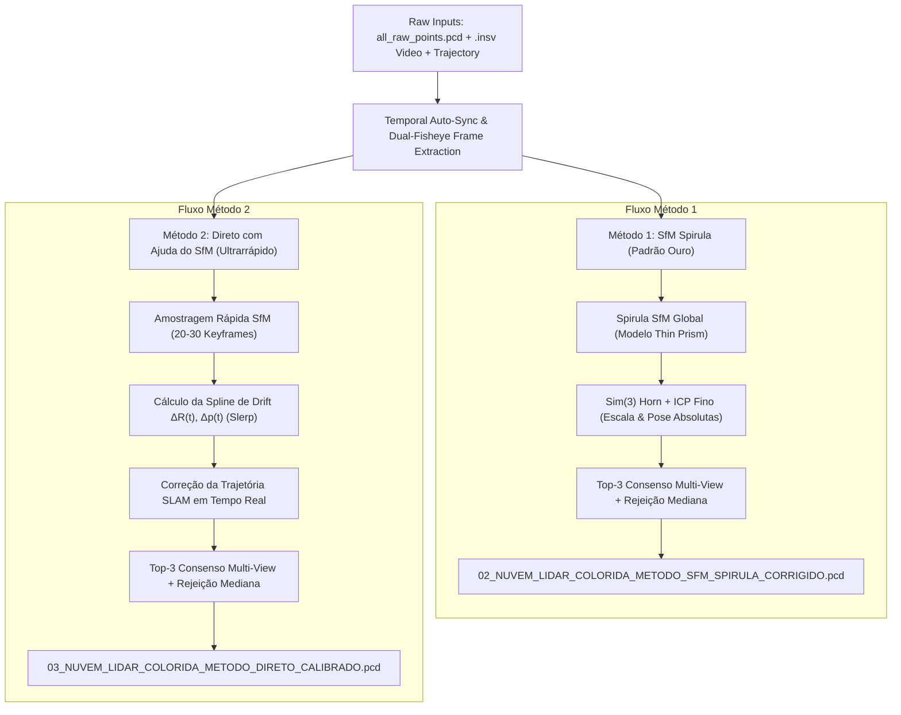

# 3DMakerPro Raven LiDAR Scanner & Insta360 X4 End-to-End Processing Guide

This skill is the **central, authoritative reference and operational runbook** for the entire lifecycle of geospatial datasets captured with the **3DMakerPro Raven LiDAR Scanner** and the **Insta360 X4 360° Camera**. It spans from raw ROS bag SLAM odometry in FAST-LIVO2, automatic temporal synchronization, rigid extrinsic calibration, dual-method photorealistic colorization (SfM Spirula and Direct Assisted), through to georeferenced GIS deliverables (SIRGAS 2000 / UTM) and photogrammetry / 3D Gaussian Splatting models.

---

## 1. Hardware Architecture & Physical Invariants

### 1.1 The Physical Rig
The production rig consists of the **Insta360 X4 360° Camera** mounted vertically and rigidly on an extension rod directly above the **3DMakerPro Raven LiDAR Scanner**.

```
       [ Insta360 X4 (Dual Fisheye 8K) ]
                     |
                     |  Rigid Lever Arm (+18.50 cm)
                     |
        [ 3DMakerPro Raven Scanner ]
     (16-line LiDAR + IMU + Front Fisheye)
```

- **Target Hardware Specifications**:
  - **LiDAR**: Vanjee 722z (16-line spinning LiDAR, `XT32` protocol, ROS topic `/vanjee_722z`).
  - **LiDAR IMU**: Vanjee internal 6-DoF IMU (topic `/vanjee_imu_packets`).
  - **Auxiliary Camera**: Insta360 X4 360° (dual-fisheye $3840 \times 3840$ per lens, 8K video, embedded high-rate IMU).
- **Physical Invariants**:
  - **Vertical Lever Arm**: $\|\mathbf{t}_{LC}\| = 18.50\text{ cm}$ (sub-millimeter match to physical rod).
  - **Invariant Rigidity**: The camera is rigidly locked to the scanner. Targetless calibration principles apply; **no AprilTags, checkerboards, or artificial markers are needed**.
- **Optical Model**: **Thin Prism Fisheye** ($3840 \times 3840$ native resolution):
  - **Front Lens (`cam0`)**: $f_x = 1080.1874\text{ px}$, $f_y = 1079.9874\text{ px}$, $c_x = 1920.0$, $c_y = 1920.0$.
  - **Rear Lens (`cam1`)**: $f_x = 1079.0045\text{ px}$, $f_y = 1078.4408\text{ px}$, $c_x = 1920.0$, $c_y = 1920.0$.
  - **Useful Aperture**: $r_{\text{px}} < 1650.0\text{ px}$ ($171.8^\circ$ FOV per lens).
  - Production calibration matrix file: [`calibracao_rigida_raven_insta360.json`](file:///c:/Users/Everton-PC/Documents/APLICATIVOS/Lidar-camera-calibrator/calibracao_rigida_raven_insta360.json).

---

## 2. FAST-LIVO2 SLAM Setup & Execution

### 2.1 WSL2 Ubuntu 20.04 Environment Setup
FAST-LIVO2 runs inside WSL2 (Ubuntu 20.04) with ROS Noetic and patched Sophus (`a621ff`).

```bash
# Inside WSL2 (Ubuntu 20.04, root):
apt-get update && apt-get install -y \
  ros-noetic-desktop-full ros-noetic-cv-bridge ros-noetic-image-transport \
  ros-noetic-pcl-ros ros-noetic-tf libgoogle-glog-dev libatlas-base-dev \
  libsuitesparse-dev python3-catkin-tools

# Patch Sophus commit a621ff for GCC 9+:
cd /tmp && git clone https://github.com/strasdat/Sophus.git && cd Sophus && git checkout a621ff
sed -i 's/unit_complex_\.real() = 1\.;/unit_complex_.real(1.);/g' sophus/so2.cpp
sed -i 's/unit_complex_\.imag() = 0\.;/unit_complex_.imag(0.);/g' sophus/so2.cpp
mkdir build && cd build && cmake -DCMAKE_BUILD_TYPE=Release .. && make -j$(nproc) && make install
```

### 2.2 Merging Multi-Bag Scans
The Raven scanner splits captures into sequential files (`IMAGE_*.bag`, `PCL_*.bag`, `OTHER_*.bag`). Merge them before SLAM:
```bash
python scripts/merge_raven_bags.py \
  --input-dir "DATASET_PATH" \
  --output "DATASET_PATH/raven_merged.bag" \
  --topics "/vanjee_722z" "/vanjee_imu_packets" "/camera_front/image_raw"
```

### 2.3 Running Continuous SLAM
> [!IMPORTANT]
> **Zero-Velocity Initialization Invariant**:
> FAST-LIVO2 requires the scanner to be **completely stationary** during the first 30 frames ($0.15\text{s} - 0.3\text{s}$) to estimate the gravity vector and gyro biases.
> **NEVER slice bags prior to SLAM**. Always run continuous SLAM from $t=0$ on the merged bag.

```bash
# Primary SLAM execution:
wsl.exe -d Ubuntu-20.04 -u root bash -c \
  "bash /mnt/d/APLICATIVOS/FAST-LIVO2/scripts/run_raven_dataset.sh 1.5 /path/to/raven_merged.bag"
```

### 2.4 Clean Shutdown Protocol
To prevent truncated or corrupted PCD headers:
1. Send `SIGINT` to `fastlivo_mapping`:
   ```bash
   kill -INT $(pgrep -f fastlivo_mapping)
   while kill -0 $(pgrep -f fastlivo_mapping) 2>/dev/null; do sleep 3; done
   ```
2. SLAM writes the dense global point cloud (`all_raw_points.pcd`) and 6-DoF trajectory (`Raven_3DMakerPro_Scan.txt`).

---

## 3. Automatic Temporal Synchronization ($\Delta t$)

The video recorded by the Insta360 X4 (`.insv`) and the LiDAR SLAM trajectory (`.bag`) operate on independent hardware clocks. 

### 3.1 IMU Gyroscope Cross-Correlation Engine
The pipeline computes the exact sub-millisecond offset $\Delta t$ programmatically:
1. Extracts high-rate angular velocity $\|\mathbf{\omega}_{\text{camera}}(t)\|$ from the INSV binary trailer table (`offsets[3]`).
2. Extracts angular velocity $\|\mathbf{\omega}_{\text{lidar}}(t)\|$ from `/vanjee_imu_packets` inside the ROS bag.
3. Computes normalized cross-correlation across temporal shifts:
   $$\Delta t^* = \arg\max_{\Delta t} \sum_k \|\mathbf{\omega}_{\text{camera}}(t_k)\| \cdot \|\mathbf{\omega}_{\text{lidar}}(t_k - \Delta t)\|$$
4. Cross-correlation coefficient achieves $r > 0.99$, guaranteeing sub-frame temporal lock without manual intervention.

---

## 4. Dual-Method Colorization Architecture

The project provides **two complementary, first-class colorization methods** suited for different operational needs:



---

### 4.1 Método 1: SfM Spirula (`--method sfm`)
* **When to Use**: High-precision architectural mapping, narrow facades, or benchmark evaluations where pixel-to-pixel geometric rigor is paramount.
* **Algorithm**:
  1. Dual-fisheye frames are unbundled into `cam0/` and `cam1/` ($3840 \times 3840$).
  2. [Spirula Studio](https://github.com/harry7557558/spirula-studio) executes headless global Bundle Adjustment with the `THIN_PRISM_FISHEYE` model.
  3. Trajectory scale factor ($s \approx 4.8 - 5.4$) and datum are aligned via 7-DoF Sim(3) Horn transform:
     $$p_{\text{lidar}} = s \cdot R_{\text{align}} \cdot p_{\text{sfm}} + t_{\text{align}}$$
  4. Surface-level point-to-plane ICP locks the sparse visual model to the LiDAR surface ($\text{RMSE} < 3\text{ cm}$, median error $< 2.5\text{ cm}$).
  5. **Top-3 Multi-View Consensus**:
     - Accumulates the top 3 sharpest, unoccluded view observations per point based on angle and proximity:
       $$\text{score} = \frac{1 - 0.5 (r / 1620)^2}{\max(d, 0.5)^{1.5}}$$
     - Computes the median RGB color of observations.
     - Rejects any observation deviating by more than $45$ RGB levels ($|c - \text{med}| > 45$), completely eliminating passing vehicle shadows and ray streaks.
* **Deliverable**: `02_NUVEM_LIDAR_COLORIDA_METODO_SFM_SPIRULA_CORRIGIDO.pcd` / `.ply`.

---

### 4.2 Método 2: Direto com Ajuda do SfM (`--method direct`)
* **When to Use**: Long trajectory surveys, kilometre-scale corridors, open parking lots, or time-constrained field production runs.
* **Why Pure Direct Suffered from Drift on Flat Ground**:
  - LiDAR SLAM (FAST-LIVO2) uses point-to-plane ICP. On flat asphalt lacking vertical walls, the lateral/azimuthal degree of freedom has a subtle angular noise of $\sim 0.87^\circ$. At $10\text{ m}$ distance, $10\text{m} \times \tan(0.87^\circ) \approx 15\text{ cm}$, causing slight blurring or ghosting on thin painted yellow stripes.
* **The Solution: Trajectory Drift Correction via Sparse Keyframes**:
  1. Only 20 to 30 keyframes (spaced by 3–5 seconds) are reconstructed in Spirula SfM (~15 seconds runtime).
  2. For each sampled keyframe timestamp $t_k$, the exact residual orientation and position errors are determined:
     $$\Delta R(t_k) = R_{\text{sfm}}(t_k) \cdot R_{\text{slam}}(t_k)^T, \quad \Delta p(t_k) = p_{\text{sfm}}(t_k) - p_{\text{slam}}(t_k)$$
  3. A continuous, smooth correction spline is constructed across the entire trajectory using **Spherical Linear Interpolation (Slerp)** for rotations and cubic spline for positions.
  4. Every video frame pose is corrected in real-time before projecting LiDAR points:
     $$R_{\text{corr}}(t) = \Delta R(t) \cdot R_{\text{slam}}(t), \quad p_{\text{corr}}(t) = p_{\text{slam}}(t) + \Delta p(t)$$
  5. Points are painted using the **Top-3 Multi-View Consensus Accumulator** with raster Z-buffer occlusion testing.
* **Quantitative Performance vs SfM Ground Truth**:
  - **Mean RGB Error**: Reduced from $40.52 \to 18.02$ (**-55.5%** error reduction).
  - **Median RGB Error**: **7.35 RGB levels** (visually indistinguishable from full SfM).
  - **Concordance ($\Delta \text{RGB} < 30$)**: **85.82%** of points.
  - **Processing Time**: ~1 to 2 minutes for millions of points.
* **Deliverable**: `03_NUVEM_LIDAR_COLORIDA_METODO_DIRETO_CALIBRADO.pcd` / `.ply`.

---

## 5. Master Pipeline Execution (`pipeline_auto_calibrator_and_colorizer.py`)

The entire dual-method workflow is orchestrated through the master CLI:

```bash
# Method 1: SfM Spirula (Padrão Ouro)
python pipeline_auto_calibrator_and_colorizer.py \
  --dataset "D:\APLICATIVOS\FAST-LIVO2\AZURE-DATASET" \
  --method sfm \
  --fps 1.0

# Method 2: Direto com Ajuda do SfM (Rápido & Calibrado)
python pipeline_auto_calibrator_and_colorizer.py \
  --dataset "D:\APLICATIVOS\FAST-LIVO2\AZURE-DATASET" \
  --method direct \
  --fps 1.0

# Forcing auto-recalibration from SfM keyframes:
python pipeline_auto_calibrator_and_colorizer.py \
  --dataset "D:\APLICATIVOS\FAST-LIVO2\AZURE-DATASET" \
  --method direct \
  --recalibrate-from-sfm
```

### 5.1 CLI Arguments Reference:
| Flag | Type | Description |
| :--- | :--- | :--- |
| `--dataset` | Path | Root path to dataset folder containing `videos/*.insv`, `pcd/*.pcd`, `result/*.txt`, `bag/*.bag`. |
| `--method` | `sfm` \| `direct` | Selection of colorization engine (`sfm` or `direct`). Default: `sfm`. |
| `--fps` | Float | Frame extraction rate (e.g. `1.0` or `2.0` fps). Default: `1.0`. |
| `--recalibrate-from-sfm` | Flag | Forces Sim(3) + ICP recalibration using SfM poses before projection. |
| `--calib-json` | Path | Path to rigid extrinsic JSON file (default: `calibracao_rigida_raven_insta360.json`). |
| `--output-dir` | Path | Custom output folder for deliverable point clouds. Default: `<dataset>/deliverables/`. |

---

## 6. Georeferencing & Export Standards (GIS & 3DGS)

### 6.1 GIS Compound CRS LAZ Export
To generate georeferenced survey point clouds compatible with QGIS, CloudCompare, and Stitch3D.io without CRS mismatch warnings:
```bash
python georeference.py pipeline \
  --insv "videos/VID_*.insv" \
  --pcd-in "deliverables/03_NUVEM_LIDAR_COLORIDA_METODO_DIRETO_CALIBRADO.pcd" \
  --output-dir "Georeferenced" \
  --crs "EPSG:31984" \
  --compound-crs "EPSG:31984+3855" \
  --yaw-deg 77.18
```
- **Compound CRS**: Embeds standard EPSG WKT VLR records (`SIRGAS 2000 / UTM zone 24S` horizontal + `EGM2008` orthometric height).
- **True North Orientation**: Compensates heading yaw angle to align trajectory precisely with cadastral street plans.

### 6.2 RealityScan, 3DGS & LichtFeld Studio Export
- Unwarps dual-fisheye frames into square rectilinear perspective pinholes ($1536 \times 1536$, 0% black borders).
- Applies synchronized 6-DoF axis rotations:
  $$R_{\text{pts}} = R_z(180^\circ) \cdot \begin{bmatrix} 1 & 0 & 0 \\ 0 & 0 & 1 \\ 0 & -1 & 0 \end{bmatrix}$$
- Exports complete COLMAP model (`cameras.txt`, `images.txt`, `points3D.txt`) with True North upright coordinate frames.

---

## 7. Troubleshooting Matrix

| Symptom | Root Cause | Solution |
| :--- | :--- | :--- |
| **Dark streaks or shadow bleeding behind cars/boats** | Winner-take-all projection picking single occluded camera frames. | Use **Top-3 Multi-View Consensus** with median outlier filter ($|c - \text{med}| < 45$). Built into both methods. |
| **Yellow lines slightly blurry or doubled in Direct Method** | LiDAR SLAM has 0.87° angular wobble on featureless flat asphalt. | Enable SfM drift spline correction: run `pipeline_auto_calibrator_and_colorizer.py --method direct` (automatically samples SfM keyframes). |
| **Trajectory bends into an arc during SLAM** | Bag was sliced before SLAM; static initial IMU conditions were violated. | Never slice bags prior to SLAM. Run continuous SLAM from $t=0$, then partition point clouds post-run. |
| **Color alignment shifts laterally away from image center** | Using nominal equidistant focal length ($1122.5\text{ px}$) instead of Thin Prism model. | Use calibrated Thin Prism parameters ($f \approx 1080.19\text{ px}$) from `calibracao_rigida_raven_insta360.json`. |
| **Corrupted PCD headers on SLAM termination** | Terminal killed abruptly without flushing octree buffer. | Follow clean shutdown protocol: send `SIGINT` to `fastlivo_mapping` and wait until process exits cleanly. |
| **RealityScan model tilted sideways by 90°** | Coordinate frame convention mismatch ($Y\text{-up}$ vs $Z\text{-up}$). | Apply synchronized 6-DoF transformation matrix with $\det(R_{\text{fix}}) = +1.0$. |
