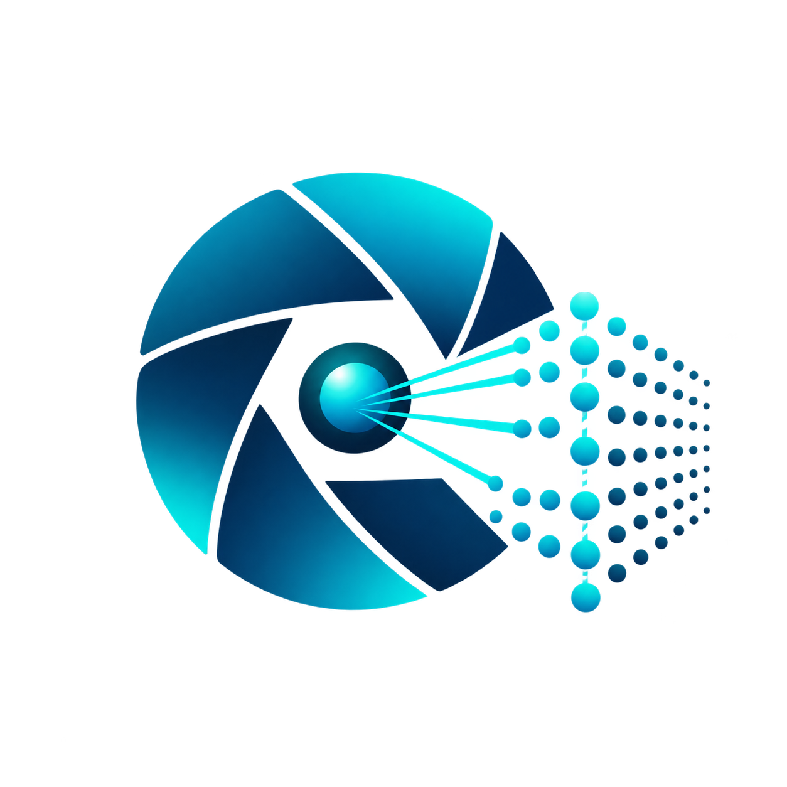

<div align="center">

# LidarCamera360

**Unified LiDAR-Inertial SLAM, 360° Camera Telemetry, Rig Calibration, and 3D Colorization Suite**

[](https://www.python.org/)
[](https://visualstudio.microsoft.com/)
[](https://www.vulkan.org/)
[](https://github.com/zhiyiYo/PyQt-Fluent-Widgets)
[](LICENSE)

<br/>



<p>
  <b>LidarCamera360</b> is an open-source, high-performance desktop application and headless CLI suite for fusing 3D LiDAR point clouds with 360° panoramic cameras (dual-fisheye). It executes offline LiDAR-inertial SLAM without requiring ROS or Linux, performs hardware-accelerated video decoding, synchronizes sensor clocks via IMU gyro cross-correlation, estimates rigid extrinsic geometry, and colorizes dense point clouds using Vulkan GPU compute shaders.
</p>

</div>

---

## 🌟 Key Capabilities

1. **In-Process ROS Bag Inspection & Processing (Zero ROS Required)**
   - Operates natively on Windows without WSL, Docker, or ROS master daemons.
   - Reads ROS1 `.bag` files, parses `sensor_msgs/PointCloud2` (with per-point timing), IMU packets, and compressed camera topics.

2. **Native Offline FAST-LIVO2 SLAM Engine**
   - Bundled MSVC C++17 offline estimator (`fastlivo2.exe`).
   - Produces high-accuracy LiDAR odometry, 6-DoF trajectories, and dense point cloud maps directly from raw packets.

3. **High-Throughput INSV Video Frame Extraction**
   - In-process dual-track decoding via bundled PyAV / FFmpeg with hardware acceleration (`CUDA`, `D3D11VA`, `VideoToolbox`, `VAAPI`).
   - Fast SIMD-based grayscale Laplacian sharpness selection across configurable window intervals.
   - Multithreaded concurrent JPEG compression and presentation timestamp (`PTS`) preservation.

4. **Programmatic IMU Gyro Cross-Correlation Time Sync**
   - Decodes embedded binary telemetry trailers from Insta360 INSV files (Gyro and Exposure records).
   - Computes Pearson cross-correlation between camera gyro angular velocity norms and LiDAR IMU gyro streams to achieve sub-millisecond clock synchronization ($\Delta t$).

5. **Thin Prism Fisheye Optical Modeling & Multi-Modal Calibration**
   - Complete 12-parameter Thin Prism fisheye distortion model ($f_x, f_y, c_x, c_y, k_1..k_4, p_1, p_2, s_{x1}, s_{y1}$).
   - Horn/Umeyama Sim(3) metric scale recovery and robust point-to-plane Trimmed ICP fine registration.
   - Pre-configured nominal rig profile for the 3DMakerPro Raven LiDAR + Insta360 X4 rig (+18.5 cm vertical lever arm).

6. **Dual-Method High-Resolution 3D Colorization**
   - **Method 1 (Reconstruction / SfM Spirula Consensus)**: Gold standard multi-view consensus projection, resolving occlusion via Z-Buffer and sharpness weighting with Vulkan compute shaders (`vulkan_colorizer.exe` with CPU fallback).
   - **Method 2 (Trajectory / Direct Rigid)**: High-speed projection directly along the SLAM trajectory with optional SfM trajectory drift correction.

7. **Export to Photogrammetry, 3DGS & GIS**
   - Generates metric COLMAP datasets (`cameras.txt`, `images.txt`, `points3D.txt`) ready for Gaussian Splatting (3DGS) and RealityCapture / RealityScan.
   - Exports GIS-ready LAZ/PLY/PCD with Compound CRS (SIRGAS 2000 / UTM).

8. **Modern Fluent UI & Multilingual Localization (i18n)**
   - Microsoft WinUI 3 Fluent Design System with Mica and Acrylic materials, dark/light theme switching.
   - Runtime localization supporting **English**, **Português (Brasil)**, **Español**, **Français**, **Deutsch**, **简体中文**, and **日本語**.

---

## 🚀 Quick Start

### Running via Python

```powershell
# Check bundled engines, GPU device, and dependencies
python lidarcamera360.py --headless doctor

# Inspect a ROS1 bag's topics and message rates
python lidarcamera360.py inspect-bag --bag D:\capture\scan.bag

# Run automated end-to-end processing (Bag + INSV -> SLAM -> Sync -> Colorize -> Deliverables)
python lidarcamera360.py workflow --bag D:\capture\scan.bag --insv D:\capture\video.insv --output D:\dataset --method direct

# Launch the desktop graphical interface
python lidarcamera360.py
```

### Running the Standalone Windows Executable

When using the pre-compiled portable bundle, keep `LidarCamera360.exe` alongside its `_internal/` directory:

```powershell
.\LidarCamera360.exe --headless doctor
.\LidarCamera360.exe workflow --bag D:\capture\scan.bag --insv D:\capture\video.insv --output D:\dataset --method direct
```

---

## 🛠️ Installation & Building from Source

### Prerequisites
- **Windows 10 / 11 (64-bit)**
- **Python 3.10+**
- **Visual Studio 2022** (C++ Desktop Development workload with MSVC v143 and Windows SDK)
- **CMake 3.24+**
- **Vulkan SDK** (for GPU compute colorization)
- **vcpkg** (for PCL, OpenCV, Eigen3, Sophus, yaml-cpp dependencies)

### Setup Environment

```powershell
# Clone repository
git clone https://github.com/Everton-Braz/Lidar-camera-calibrator.git
cd Lidar-camera-calibrator

# Create virtual environment and install Python requirements
python -m venv .venv
.\.venv\Scripts\Activate.ps1
pip install -r requirements.txt
```

### Build Native SLAM and Vulkan Engines

```powershell
# Automated build using provided PowerShell tool
.\tools\build_windows.ps1 -VcpkgRoot D:\vcpkg -InstallDependencies
```

For complete build instructions and packaging steps, see [docs/BUILD.md](docs/BUILD.md).

---

## 📂 Project Structure

```text
LidarCamera360/
├── assets/                                 # Brand assets (logo, application icons)
│   ├── logo.png
│   └── app.ico
├── configs/                                # Sensor rig configurations & parameters
│   ├── rig_profile.json                    # Canonical 3DMakerPro Raven + Insta360 X4 profile
│   ├── camera.yaml                         # Camera intrinsic matrix
│   └── slam.yaml                           # FAST-LIVO2 LiDAR odometry parameters
├── docs/                                   # Architectural guides and technical specs
│   ├── BUILD.md                            # Native compilation and bundling instructions
│   ├── STANDALONE.md                       # Comprehensive operator manual
│   └── IMPLEMENTATION_VALIDATION.md        # Calibration accuracy & comparison benchmarks
├── FAST-LIVO2/                             # HKU MARS FAST-LIVO2 LiDAR-inertial-visual SLAM
├── locales/                                # Internationalization catalogs (JSON)
│   ├── en.json                             # Canonical English source
│   ├── pt-BR.json                          # Português (Brasil)
│   ├── es.json                             # Español
│   ├── fr.json                             # Français
│   ├── de.json                             # Deutsch
│   ├── zh-CN.json                          # 简体中文
│   └── ja.json                             # 日本語
├── native/                                 # C++17 standalone MSVC offline adapter
├── raven_app/                              # Core Python application package
│   ├── branding.py                         # Application identity & version metadata
│   ├── cli.py                              # Command-line interface parser
│   ├── config.py                           # Settings and tool validation
│   ├── dataset.py                          # Dataset paths and schema normalization
│   ├── gui.py                              # Fluent UI main window and navigation
│   ├── i18n.py                             # Localization runtime translation layer
│   ├── process_runner.py                   # Async job runner with clean cancellation
│   ├── video.py                            # Accelerated dual-track INSV video extraction
│   ├── vulkan_engine.py                    # Vulkan GPU compute shader bridge
│   ├── workflow.py                         # End-to-end pipeline orchestrator
│   └── views/                              # WinUI Fluent tab views
│       ├── calibration_view.py             # Rig calibration editor
│       ├── colorize_view.py                # Standalone colorization studio
│       ├── doctor_view.py                  # System diagnostics & engine health
│       ├── inspect_view.py                 # ROS Bag inspector
│       ├── settings_view.py                # Themes, tools & language selection
│       ├── slam_view.py                    # FAST-LIVO2 mapping studio
│       └── unified_workflow_view.py        # Single-click unified workflow
├── scripts/                                # Standalone CLI processing modules
│   ├── align_colmap_to_lidar.py            # Umeyama Sim(3) metric trajectory alignment
│   ├── colorize_direct_rigid_method.py     # Trajectory direct projection
│   ├── colorize_lidar_multiview_fisheye.py # Multi-view calibrated colorizer
│   ├── colorize_sfm_spirula_method.py      # SfM consensus colorizer
│   ├── correlate_imu_gyro.py               # IMU gyro temporal synchronization
│   ├── parse_insv_telemetry.py             # INSV binary trailer telemetry parser
│   ├── pipeline_auto_calibrator_and_colorizer.py # Master unified script
│   └── run_automatic_icp_calibration.py    # Robust point-to-plane ICP fine calibration
├── tests/                                  # Automated unit and integration test suite
├── tools/                                  # Build and packaging automation
│   ├── build_windows.ps1                   # MSVC build script
│   └── package_app.py                      # Standalone PyInstaller packager
├── lidarcamera360.py                       # Primary application entry point
├── raven.py                                # Backward-compatible entry alias
├── LICENSE                                 # Dual-licensing terms
├── THIRD_PARTY_NOTICES.md                  # Detailed third-party license audit
└── requirements.txt                        # Python dependencies
```

---

## 📜 Open Source Licensing & Compliance

LidarCamera360 embraces an open, transparent licensing architecture:

- **Original Project Code**: Independently authored Python orchestration, mathematical routines, and Vulkan compute shaders (`colorizer.comp`) are released under the permissive **MIT License** in [LICENSE](LICENSE).
- **Packaged Application Suite & Desktop Binary**: To comply with upstream open-source copyleft licenses—notably **FAST-LIVO2** (GPL-2.0-only), **Spirula Studio** (GPL-3.0), and the **PyQt6 / PyQt6-Fluent-Widgets** runtime (GPL-3.0 / GPLv3)—the combined desktop application distribution is provided under the terms of the **GNU General Public License v3 (GPLv3)**.
- For complete dependency licenses, notices, and source distribution conditions, see [THIRD_PARTY_NOTICES.md](THIRD_PARTY_NOTICES.md).

---

## 🤝 Contributing

Contributions, bug reports, and hardware profile additions are welcome! Please open an issue or submit a pull request on GitHub.
