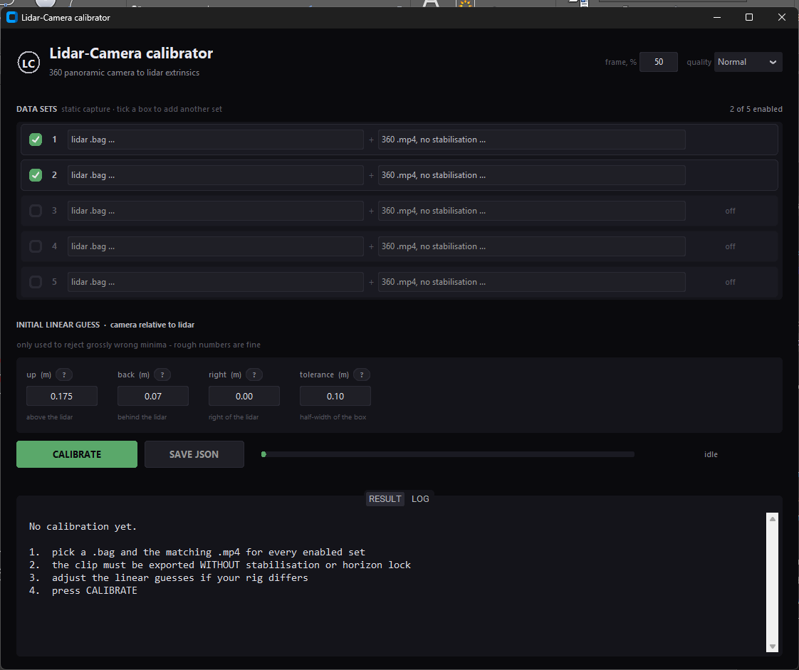

# Lidar-Camera calibrator

Finds the extrinsics between a 360° panoramic camera and a lidar mounted on the
same rig, from ordinary static captures. No checkerboard, no targets, no manual
point picking — you record a few seconds with the rig standing still, load the
files and press one button.

The result is a JSON file with the 4×4 transform, ready to drop into a
colorization or mapping pipeline.



---

## What you need

For every data set — **one lidar recording and one video, captured at the same
time by the same rig**:

| file | what it is | notes |
|---|---|---|
| `.bag` | lidar recording | must contain a lidar topic **and an IMU topic** |
| `.mp4` | 360° video from the panoramic camera | equirectangular 2:1, **no stabilisation** |

Two sets are enough. The tool accepts up to five and uses them to cross-check
each other; a single set gives you no way to tell a good answer from a
plausible one, and the tool will say so.

### Recording the data

**Keep the rig completely still.** Put it on a tripod or on the floor and do not
touch it. 20–30 seconds is plenty. The tool checks the IMU and warns you if the
rig moved.

**Point it at varied geometry, both near and far.** This matters more than
anything else:

- **near objects (1–3 m)** determine the *offsets* — how far the camera sits from
  the lidar;
- **distant objects** determine the *angles*.

A capture of a wide empty space gives good angles and vague offsets. A capture
in a tight corner gives the opposite. You want both in the same shot: a doorway
or a shelf a couple of metres away, and a corridor or a facade further out.

**Make sure vertical lines are visible** — door frames, wall corners, poles. The
tool reads the true vertical off them, and that pins two of the three angles.
Without them the accuracy drops noticeably.

**Move the rig between sets.** Put it somewhere else and turn it to face a
different direction. Two captures from the same spot just repeat the same error
twice and the cross-check becomes meaningless.

### Exporting the video

The clip must be **equirectangular** (2:1 aspect, e.g. 7680×3840) and exported
**without stabilisation and without horizon lock**. Stabilisation rotates the
frame independently of the rig, which breaks the fixed relationship the
calibration is looking for. The tool tries to detect it and warns you, but it
cannot always tell — check your export settings.

The video does not have to start or stop with the lidar. It just has to cover
the moment the frame is taken from.

---

## Running it

### Windows, no install

**[Download LidarCameraCalibrator.exe](https://drive.google.com/file/d/1vraOmX9oui2CIOSxlclqEKgQCtxCV0s_/view?usp=drive_link)** (~100 MB)
and double-click it. Nothing else is needed - no Python, no libraries. The first
start takes a few seconds while it unpacks itself.

Windows SmartScreen may warn about an unsigned application: choose *More info*
then *Run anyway*, or build it yourself as described below.

### From source

Double-click **`calibrate.bat`**. The launcher finds Python, checks the
libraries and opens the window; a console appears only if something is missing
and tells you what to install.

Or manually:

```
pip install -r requirements.txt
python gui.py
```

Requires Python 3.9+.

### Building the exe yourself

Run **`build.bat`**. It installs PyInstaller if needed and writes
`dist\LidarCameraCalibrator.exe` (about 100 MB, everything bundled).

---

## Using the interface

**1. Data sets.** Five rows, each a lidar `.bag` and its matching `.mp4`. The
first two are enabled; tick a checkbox to add another. The row lights up green
when both files are chosen.

**2. Frame, %** (top right). Which frame to take from the clip. The default 50 %
is the middle, which is usually right — at the very start the rig may still be
settling after you pressed record.

**3. Initial linear guess.** Roughly where the camera sits relative to the lidar:

| field | meaning |
|---|---|
| `up` | how far the camera is **above** the lidar (negative if below) |
| `back` | how far the camera is **behind** the lidar, against the direction it looks |
| `right` | how far the camera is to the **right** (negative if left) |
| `tolerance` | half-width of the accepted range |

Each field has a `?` button with the same explanation in the app.

Measure with a tape, a few centimetres of error is fine. These numbers only
reject grossly wrong answers — the tool does not trust them, it just refuses
solutions outside `guess ± tolerance`. Keep the tolerance wide enough that the
true value certainly falls inside, and narrow enough to exclude nonsense.

**4. Quality.** How deep the refinement goes. Rough timings for three sets:

| | time |
|---|---|
| Fast | ~10 min |
| Normal | ~25 min |
| High | ~40 min |

`Normal` is the sensible default.

**5. CALIBRATE.** The button turns into STOP while it works. Progress and a full
log are in the LOG tab.

**6. SAVE JSON** once you are happy with the result.

The first run on a bag unpacks the cloud and caches it next to the bag as
`*.calib_cache.npz`, so repeated runs start much faster. The cache is safe to
delete.

---

## Reading the result

### Per set

Every set is solved on its own so you can see whether they agree:

```
set                        status    yaw/pitch/roll  deg   C in lidar frame  m   up/back/right  cm   score
scan_00004                 OK        -89.59 / 36.63 / 2.05  0.208, -0.098, 0.140  13.4 / 6.8 / 3.2   0.135
```

- **score** — alignment quality. Higher is better; anything under 0.06 is
  rejected as unusable.
- **up/back/right** — the same rig-frame numbers you typed as a guess, so you can
  compare directly with your tape measure.

### Cross-check

Before calling sets contradictory, each set's answer is scored **on the other
sets**:

```
          set1      set2      set3
   set1   0.0846   0.0343   0.0171
   set2   0.0881   0.1488   0.0648
   set3   0.0706   0.0558   0.0701
```

Read the rows: row `set2` is that set's answer applied to all three. Here it
explains every set, and on set1 it scores even better (0.0881) than set1's own
answer (0.0846) — meaning set1 had over-fitted its own scene. That answer is
taken as the starting point instead of set1 being blamed.

If no answer works everywhere, you get **"THE SETS COULD NOT BE RECONCILED"**
and the per-set numbers, so you can decide which capture to trust or redo.

### Consensus

```
camera above lidar     +18.3 cm
camera behind           +6.9 cm
camera to the right     -0.4 cm
euler ZYX              yaw -89.512   pitch 34.417   roll -0.616
alignment score        0.1132
heading margin         1.91 sigma
agreement              angular ~0.6 deg, linear ~73 mm (spread of 3 sets)
least-squares resid    0.35 deg / 58 mm
zenith cross-check     0.84 deg
```

- **heading margin** — how far the chosen orientation stands out from the rest of
  the circle. Below ~1 sigma the answer is shaky.
- **agreement** — how much the sets disagree with each other. This is the honest
  accuracy figure, not the alignment score.
- **zenith cross-check** — the angle between the vertical measured from image
  lines and the gravity from the lidar IMU, mapped through the result. These are
  two independent sources, so a small number here means the angles are right.

### Warnings

| message | meaning |
|---|---|
| bag and mp4 may not be from the same capture | the cloud does not lock onto this video, or its heading disagrees with the other sets |
| stabilisation is likely on | the horizon drifts across the clip — re-export without stabilisation |
| rig was moving during the scan | the IMU saw motion; the capture must be static |
| no close geometry / no distant geometry | offsets or angles will be weakly determined |
| only one set was accepted | nothing cross-checked the answer, add another set |

---

## The output file

`SAVE JSON` writes a file like this:

```json
{
  "T_base_camera_lidar": [
    [ 0.00925008, -0.99971817,  0.02186353, -0.00244837],
    [ 0.82878686, -0.00456859, -0.55954577,  0.17597543],
    [ 0.55948796,  0.02329605,  0.82851102,  0.08242581],
    [ 0.0,          0.0,         0.0,         1.0       ]
  ],
  "_determined": {
    "lever_arm_cam_in_lidar_m": [-0.19194, -0.00356, 0.03023],
    "refine_deg": [27.7187, -25.5682, 86.9597],
    "handeye_resid_deg": 0.35,
    "drift_from_imu_deg": 0.84
  },
  "_calibration": { "...": "conventions, per-set results, cross-check matrix" }
}
```

**`T_base_camera_lidar`** is what you normally need — a 4×4 matrix taking a point
from the lidar frame into the camera frame:

```
X_cam = R @ X_lidar + t        R = T[:3,:3]   t = T[:3,3]
```

Camera axes are **X right, Y down, Z forward** (OpenCV). The equirect mapping is

```
u = (atan2(X, Z) / 2pi + 0.5) * W
v = (0.5 - asin(-Y / r) / pi) * H
```

**One thing to watch:** `lever_arm_cam_in_lidar_m` is the camera position in the
**lidar coordinate frame**, not in rig terms. If the lidar is mounted at an
angle, those numbers will not match the up/back/right you typed. The rig-frame
values live separately in `_calibration.rig_offsets_m`.

`_calibration` also carries the per-set results, the cross-check matrix, the
conventions and the guess that was used, so a file can be traced back to the
data it came from.

---

## Accuracy, honestly

On good captures expect roughly **0.5–1° in angle and 1–3 cm in offsets**.

The angles are the reliable part. The offsets depend on parallax, which needs
geometry close to the rig — if your captures are all wide open spaces, the
offsets will stay approximate no matter how long the tool runs. The `agreement`
line in the result tells you which case you are in.

Two further limits are worth knowing:

- a stitched 360° panorama has no single centre of projection (the lenses are a
  few centimetres apart), which costs about a degree on nearby objects;
- the tool aligns edges, so a scene without clear edges — bare walls, fog, heavy
  glass — gives a shallow optimum and a shaky answer.

---

## Supported data

- **lidar**:
  - **3DMakerPro Raven LiDAR Scanner** (`/vanjee_722z`, 16-line spinning mechanical LiDAR).
  - Standard `sensor_msgs/PointCloud2` (topics matching `vanjee`, `722z`, `lidar`, `point`, `cloud`, `velodyne`, `hesai`, `rslidar`, `ouster`).
  - Livox `CustomMsg` (`livox_ros_driver/CustomMsg`, `livox_ros_driver2/CustomMsg`).
- **IMU**:
  - Raven Vanjee internal IMU (`/vanjee_imu_packets`).
  - Any ROS topic matching `imu` (`sensor_msgs/Imu`). Required — it provides the gravity reference vector.
- **camera**:
  - **Insta360 X4** (and Insta360 X3 / ONE RS 1-Inch 360 / ONE X2 / etc.).
  - Any 2:1 equirectangular 360° video (`.mp4`) exported **without stabilisation / horizon lock**, readable by OpenCV.

---

## Files

| | |
|---|---|
| `generate_apriltags.py` | generates print-ready AprilTags & calibration boards |
| `apriltag_calib.py` | AprilTag-based LiDAR-Camera extrinsic calibrator |
| `apriltags_to_print/` | folder containing generated high-res printable tags & boards |
| `calibrate.bat` | launcher (source install) |
| `build.bat` | builds the standalone exe |
| `gui.py` | interface |
| `solver.py` | joint search, cross-check, screening, least-squares merge |
| `core.py` | geometry, data loading, edge extraction, optimisation |
| `colorize.py` | point cloud colorizer (exports .ply, .pcd, .las, .laz) |
| `selftest.py` | headless run, paths set inside the file |

---

## AprilTag-Based Calibration

In addition to targetless edge alignment, you can perform target-based calibration using printable **AprilTags (family `tag36h11`)** and dual-modality calibration boards:

### 1. Generating & Printing Targets
To generate high-resolution print-ready targets:
```bash
# Generate 12 targets (family tag36h11, nominal size 150 mm)
python generate_apriltags.py --count 12 --size 150 --out apriltags_to_print
```
All targets are saved in `apriltags_to_print/`.
- **Print at 100% scale (No scaling / 'Fit to page')**.
- Use the printed **100 mm reference ruler** at the bottom of each sheet to verify exact scale with a physical ruler.
- (Optional): Add 10 mm retroreflective tape along the crosshair guidelines for dual-modality LiDAR stripe detection.
- Affix boards firmly to flat surfaces (walls, poles, cardboard) around the capture area.

### 2. Running AprilTag Calibration
```bash
# Verify the solver with built-in synthetic self-test:
python apriltag_calib.py --selftest

# Calibrate using video and ROS bag:
python apriltag_calib.py --video path/to/video.mp4 \
                         --bag path/to/lidar.bag \
                         --tag-size 0.150 \
                         --out extrinsics_determined.json \
                         --overlay
```

---

## Point Cloud Colorization

Once you have calibrated the extrinsics (`extrinsics_determined.json`), colorize any point cloud directly with `colorize.py`:

```bash
# Export colorized PLY (binary format, viewable in CloudCompare / MeshLab / Blender)
python colorize.py --bag path/to/lidar.bag \
                   --video path/to/video.mp4 \
                   --calib path/to/extrinsics_determined.json \
                   --out colorized_cloud.ply

# Export colorized PCD format
python colorize.py --bag path/to/lidar.bag \
                   --video path/to/video.mp4 \
                   --calib path/to/extrinsics_determined.json \
                   --out colorized_cloud.pcd
```
