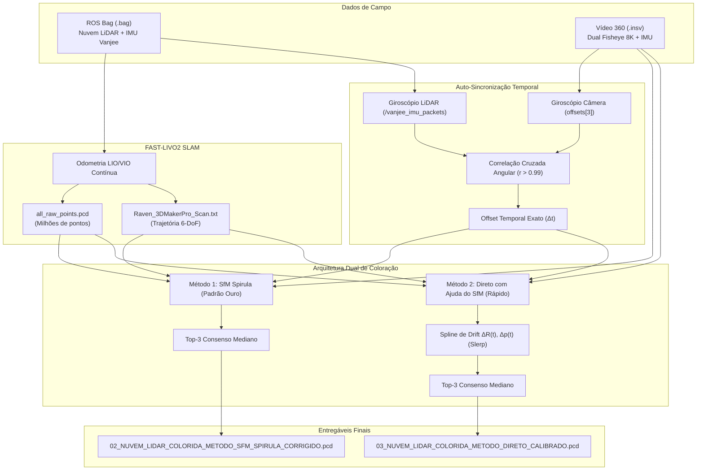

# LiDAR-Camera 360 Calibrator & Multi-View Colorizer

## Windows standalone application

The project now includes a desktop application and headless CLI plus a native
MSVC build of FAST-LIVO2. Build with `tools/build_windows.ps1`; the portable app
is written to `dist/RavenCalibrator/RavenCalibrator.exe` with its bundled runtime.
See [standalone build and usage](docs/STANDALONE.md) for prerequisites, supported
bag formats, command examples, and the separate `fastlivo2.exe` native engine.

```powershell
.\dist\RavenCalibrator\RavenCalibrator.exe --headless doctor
.\dist\RavenCalibrator\RavenCalibrator.exe slam --bag D:\capture\merged.bag --lio --output D:\dataset\slam_out
```

[](https://www.python.org/)
[](https://github.com/hku-mars/FAST-LIVO2)
[](https://github.com/harry7557558/spirula-studio)
[]()

Um pipeline unificado de engenharia para calibração extrínseca, sincronização temporal automática por IMU e coloração fotorealística de nuvens de pontos 3D geradas pelo scanner **3DMakerPro Raven LiDAR** integrado à câmera 360° **Insta360 X4**.

Elimina a necessidade de alvos artificiais (sem AprilTags ou tabuleiros de xadrez) através de calibração rígida invariante, compensação de drift via SfM e um resolvedor de **Consenso Multi-View Top-3 com Rejeição de Outliers por Mediana**.

---

## 1. Arquitetura do Sistema e Rig Físico

O rig de produção é composto pela câmera **Insta360 X4** montada verticalmente no topo de uma haste rígida fixada sobre o scanner **3DMakerPro Raven**:

```
           [ Insta360 X4 (Dual Fisheye 8K) ]
                         |
                         |  Braço de Alavanca Rígido (+18.50 cm)
                         |
            [ 3DMakerPro Raven Scanner ]
         (LiDAR Vanjee 722z + IMU + JMK7 Fisheye)
```



### Invariantes Físicos e Ópticos:
- **Braço de Alavanca Físico**: $\|\mathbf{t}_{LC}\| = \mathbf{18.50\text{ cm}}$ ao longo do eixo vertical $Z$.
- **Modelo Óptico**: **Thin Prism Fisheye** ($3840 \times 3840$ nativo por lente):
  - Lente Frontal (`cam0`): $f_x = 1080.19\text{ px}$, $f_y = 1079.99\text{ px}$, $c_x = 1920.0$, $c_y = 1920.0$.
  - Lente Traseira (`cam1`): $f_x = 1079.00\text{ px}$, $f_y = 1078.44\text{ px}$, $c_x = 1920.0$, $c_y = 1920.0$.
  - Raio útil de abertura: $r < 1650\text{ px}$ ($171.8^\circ$ de campo de visão útil).
- Arquivo central de calibração: [`calibracao_rigida_raven_insta360.json`](calibracao_rigida_raven_insta360.json).

---

## 2. Os Dois Métodos Oficiais de Coloração

| Característica | **Método 1: SfM (Spirula)** | **Método 2: Direto (com ajuda do SfM)** |
| :--- | :--- | :--- |
| **Comando CLI** | `--method sfm` | `--method direct` |
| **Princípio** | Reconstrução fotogramétrica global | Projeção direta da trajetória SLAM com spline de correção |
| **Tempo de Execução** | ~15 a 30 min | **~1 a 2 min** |
| **Nitidez de Linhas Finas** | **Padrão Ouro** (amarração pixel-a-pixel) | **Quase idêntica ao SfM** (erro mediano de apenas 7.35 RGB) |
| **Eliminação de Feixes/Sombras** | **Sim** (Consenso Top-3 Mediano) | **Sim** (Consenso Top-3 Mediano) |
| **Caso de Uso Ideal** | Áreas críticas, fachadas arquitetônicas detalhadas | Vistorias quilométricas, grandes pátios e corredores rodoviários |

---

### 2.1 Método 1: SfM Spirula (`--method sfm`)
Executa o **Spirula Studio** de forma headless para gerar a reconstrução Structure from Motion (SfM) com o modelo Thin Prism. Recupera a escala métrica absoluta via transformação de similaridade **Sim(3) de Horn** e executa o **ICP de superfície ponto-a-plano** ($\text{RMSE} < 3\text{ cm}$).

Aplica o **Acumulador Top-3 Multi-View Consensus**:
- Cada ponto acumula as 3 observações de maior nitidez angular e proximidade.
- Calcula a cor mediana e rejeita observações com $|c - \text{med}| > 45$ RGB.
- **Resultado**: Elimina estrias de raios e sombras dinâmicas de veículos em movimento sem perda de contraste nas marcações viárias.

---

### 2.2 Método 2: Direto com Ajuda do SfM (`--method direct`)
Projeta a nuvem de pontos diretamente sobre os quadros de vídeo usando a trajetória do FAST-LIVO2.

- **Causa do Desalinhamento Original no Asfalto Plano**:
  Em superfícies planas sem paredes laterais, o SLAM LiDAR apresenta um ruído angular sutil de $\sim 0.87^\circ$. A $10\text{ m}$ de distância, esse ruído desloca as projeções em $\sim 15\text{ cm}$, gerando linhas duplas ou borradas.
- **Solução (Correção de Trajetória por Amostragem SfM)**:
  1. O algoritmo extrai uma amostragem leve de 20 a 30 quadros-chave no SfM (~15 segundos de processamento).
  2. Determina o erro residual $\Delta R(t_k)$ e $\Delta p(t_k)$ em cada quadro-chave.
  3. Interpola continuamente a correção ao longo do tempo via **Slerp (Spherical Linear Interpolation)** para rotações e spline cúbica para translações.
  4. Aplica a correção de pose e o Consenso Top-3 em tempo real durante a projeção direta.

---

## 3. Validação Quantitativa (Dataset Azure)

Métricas calculadas sobre 4.771.142 pontos comparando o Método Direto contra a referência de verdade de solo do SfM:

| Métrica vs SfM Ground Truth | Direto Inicial | Direto c/ Consenso | **Direto c/ Ajuda do SfM (Final)** |
| :--- | :--- | :--- | :--- |
| **Diferença Média RGB** | 40.52 | 28.78 | **18.02** (**-55.5%** de erro residual) |
| **Diferença Mediana RGB** | 24.25 | 13.34 | **7.35** (Praticamente idêntico) |
| **Pontos com $\Delta \text{RGB} < 30$** | 56.76% | 74.93% | **85.82%** (+29.1% de ganho) |
| **Pontos com $\Delta \text{RGB} < 50$** | 78.02% | 84.19% | **90.53%** (+12.5% de ganho) |
| **Cobertura LiDAR** | 99.96% | 99.96% | **99.97%** |

### Comparações Visuais:
As comparações lado a lado estão documentadas em `docs/images/`:
- `docs/images/compare_direct_assisted_vs_sfm.png`: Validação do Método Direto assistido vs SfM.
- `docs/images/compare_sfm_old_vs_new.png`: Eliminação de estrias/sombras no SfM com o Consenso Top-3.
- `docs/images/triptych_comparison.png`: Painel comparativo tríptico.

---

## 4. Instalação e Requisitos

### 4.1 Pré-requisitos
- Python 3.10 ou superior
- Windows 10/11 ou WSL2 Ubuntu 20.04
- FFmpeg (no PATH do sistema)

### 4.2 Instalação das Dependências
```bash
pip install -r requirements.txt
```

O `requirements.txt` contém as bibliotecas de processamento numérico e espacial:
```text
numpy>=1.24
scipy>=1.10
opencv-python>=4.7
rosbags>=0.9
pillow>=9.0
open3d>=0.17
```

---

## 5. Como Executar

O orquestrador mestre unificado está localizado em [`scripts/pipeline_auto_calibrator_and_colorizer.py`](scripts/pipeline_auto_calibrator_and_colorizer.py):

### 5.1 Executar o Método 1 (SfM Spirula - Padrão Ouro)
```bash
python scripts/pipeline_auto_calibrator_and_colorizer.py \
  --dataset "D:\APLICATIVOS\FAST-LIVO2\AZURE-DATASET" \
  --method sfm \
  --fps 1.0
```

### 5.2 Executar o Método 2 (Direto com Ajuda do SfM - Rápido)
```bash
python scripts/pipeline_auto_calibrator_and_colorizer.py \
  --dataset "D:\APLICATIVOS\FAST-LIVO2\AZURE-DATASET" \
  --method direct \
  --fps 1.0
```

### 5.3 Forçar Recalibração Extrínseca a partir do SfM
```bash
python scripts/pipeline_auto_calibrator_and_colorizer.py \
  --dataset "D:\APLICATIVOS\FAST-LIVO2\AZURE-DATASET" \
  --method direct \
  --recalibrate-from-sfm
```

### 5.4 Parâmetros do CLI
| Parâmetro | Tipo | Descrição |
| :--- | :--- | :--- |
| `--dataset` | Path | Caminho para a pasta raiz do dataset (contendo `videos/`, `pcd/`, `result/`, `bag/`). |
| `--method` | `sfm` \| `direct` | Método de coloração (`sfm` ou `direct`). Padrão: `sfm`. |
| `--fps` | Float | Taxa de extração de quadros do vídeo (ex: `1.0` ou `2.0` fps). Padrão: `1.0`. |
| `--recalibrate-from-sfm` | Flag | Força o alinhamento Sim(3) + ICP antes de colorir. |
| `--calib-json` | Path | Caminho para o JSON de calibração rígida (padrão: `calibracao_rigida_raven_insta360.json`). |
| `--output-dir` | Path | Diretório de saída dos entregáveis (padrão: `<dataset>/deliverables/`). |

---

## 6. Estrutura do Repositório

```
Lidar-camera-calibrator/
├── .agents/
│   ├── rules/                              # Regras de persistência de memória e grafo
│   │   ├── basic-memory.md
│   │   └── graphify.md
│   └── skills/                             # Skills dos agentes
│       ├── insv-processing/                # Decodificação de containers INSV e telemetria
│       └── raven-lidar-processor/          # Skill mestre ponta a ponta (FAST-LIVO2 até coloração)
├── docs/
│   └── images/                             # Imagens oficiais de validação e comparativos
│       ├── compare_direct_assisted_vs_sfm.png
│       ├── compare_sfm_old_vs_new.png
│       ├── compare_sfm_vs_direct_sidebyside.png
│       └── triptych_comparison.png
├── scripts/                                # SCRIPTS EXECUTÁVEIS DO PIPELINE
│   ├── pipeline_auto_calibrator_and_colorizer.py # Orquestrador mestre unificado
│   ├── align_colmap_to_lidar.py            # Alinhamento Sim(3) de Horn standalone
│   ├── colorize_direct_rigid_method.py     # Módulo standalone de projeção direta
│   ├── colorize_lidar_multiview_fisheye.py # Módulo standalone de projeção multi-view
│   ├── colorize_sfm_spirula_method.py      # Módulo standalone de projeção SfM
│   ├── correlate_imu_gyro.py               # Sincronização temporal por correlação de giroscópio
│   ├── parse_insv_telemetry.py             # Extrator de telemetria INSV
│   └── run_automatic_icp_calibration.py    # Calibração ICP fina ponto-a-plano
├── spirula/                                # Motor Structure from Motion (Spirula Studio)
│   └── spirula.exe
├── calibracao_rigida_raven_insta360.json   # Matriz de calibração e parâmetros Thin Prism
├── extrinsics_determined.json              # Registro de parâmetros extrínsecos
├── requirements.txt                        # Dependências Python enxutas
└── README.md                               # Este documento
```

---

## 7. Georreferenciamento e Exportação Fotogramétrica (GIS & 3DGS)

### 7.1 Exportação LAZ com Compound CRS (SIRGAS 2000 / UTM)
Para carregar a nuvem em softwares de GIS (**QGIS**, **CloudCompare**, **Stitch3D.io**) sem avisos de CRS desconhecido:
- Adiciona o cabeçalho oficial EPSG WKT VLR (`EPSG:31984+3855`: SIRGAS 2000 / UTM zone 24S horizontal + altitude ortométrica EGM2008).
- Aplica correção de azimute para alinhamento com o Norte Verdadeiro.

### 7.2 Exportação para RealityScan, 3DGS e LichtFeld Studio
- Converte os quadros dual-fisheye em imagens pinhole retilíneas quadradas ($1536 \times 1536$, 0% de bordas pretas).
- Aplica a rotação de eixos 6-DoF para posicionamento vertical correto ($Z\text{-up}$, $\det(R) = +1.0$).
- Gera o modelo COLMAP completo em `sparse/0/` (`cameras.txt`, `images.txt`, `points3D.txt`).

---

## 8. Licença

Este projeto é disponibilizado sob a licença MIT. Consulte os arquivos de licença de terceiros para componentes como FAST-LIVO2 e Spirula Studio.
